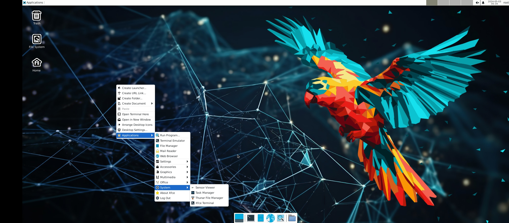

# Parrot-os on Termux 
> Install The ultimate framework for your Cyber Security operations.The operating system for Hackers 😈



# Installation
> just copy and paste bellow command in your termux 
* Note indian user must connect VPN
```
curl -sSL https://raw.githubusercontent.com/Anon4You/Parrot-os/main/install.sh | bash
```
## Fixes 
* Pulseaudio sound fix ✅
* Parrot-Os full Desktop ✅
* Works on Termux-X11 ✅

## Watch more from me 
* [YouTube](https://www.youtube.com/@alienkrishnorg) 
